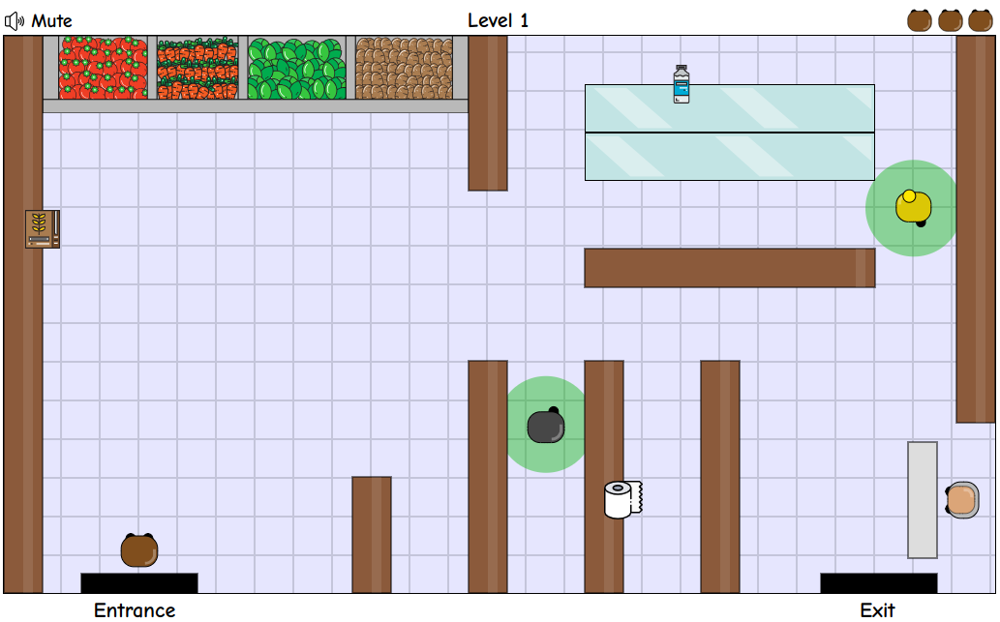

# Corona Market
CoronaMarket is an open source game created during the coronavirus pandemic.  
The goal of the game is to buy groceries without getting infected with the virus.  

## How to play
The game is available **[here](http://coronamarket.cc)**.  
To play locally, clone the repository and start a local server (e.g. `python -m SimpleHTTPServer`).

## Screenshots

## Custom levels
[todo]

## Credits
- Game created by [Dor Cohen](https://github.com/dordchn).  
- Sound effects & music obtained from [zapsplat](https://www.zapsplat.com).  
- Icons made by [Freepik](https://www.flaticon.com/authors/freepik) from [www.flaticon.com](https://www.flaticon.com/).